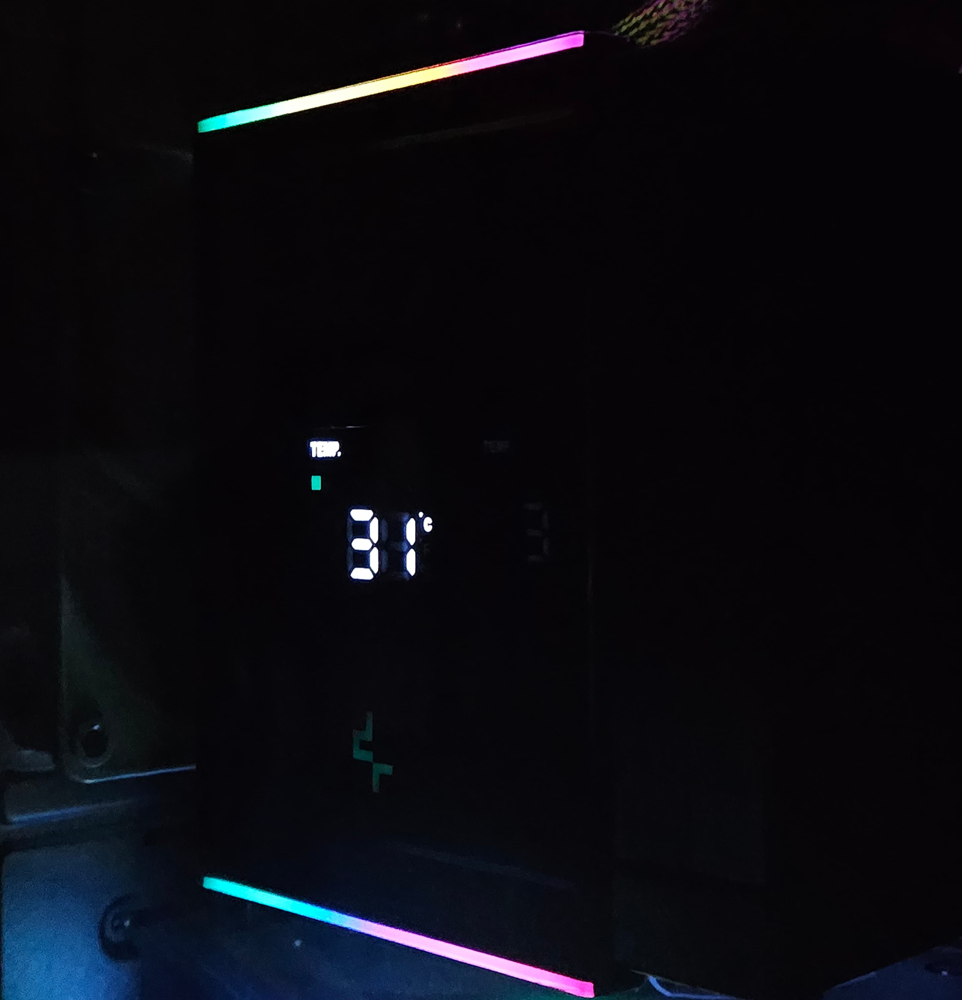

# AK500 DIGITAL Service

Open-source system monitor background service designed for the DEEPCOOL AK500 DIGITAL CPU display. Its primary goal is to drive the display under Linux, avoiding the need for a clunky Electron app that has no linux releases just to power the monitoring.

This is intended as a replacement to the [DeepCool DIGITAL Control Software](https://www.deepcool.com/downloadpage/)

Currently, it only supports Linux as the library for CPU temperature monitoring does not yet support Windows.

## Configuration

The configuration file is loaded from `/etc/ak500-digital/config.toml` you can find an example [Here](./example-config.toml)

The commands below will set the current config to the example config


```sh
# Create the config directory (Only required for first time)
sudo mkdir /etc/ak500-digital

# Copy the example config
sudo cp ./example-config.toml /etc/ak500-digital/config.toml
```

Development is done on **Fedora** you will need to adapt these commands to your specific distribution

## Native Dependencies

libudev - Used for USB device access, required to build the executable

```sh
sudo dnf install libudev-devel 
```

## Unprivileged USB access

By default linux will not allow access to HID devices without sudo.

You can allow unprivileged access to the UPS HID device by doing the following

Create a rules file at `/etc/udev/rules.d/50-ak500-digitial.rules` in this file put the following line:

```
KERNEL=="hidraw*", ATTRS{idVendor}=="3633", ATTRS{idProduct}=="0003", TAG+="uaccess"
```

Then, replug your device or run:

```sh
sudo udevadm control --reload-rules && sudo udevadm trigger
```

This will allow the program to access the device without requiring sudo

## Installation

Below are the instructions for installing:

```sh
# Build release binary
cargo build --release

# Copy release binary to /usr/local/bin
sudo cp ./target/release/ak500-digital-rs /usr/local/bin/ak500-digital

# Create the config directory
sudo mkdir /etc/ak500-digital

# Copy the example config
sudo cp ./example-config.toml /etc/ak500-digital/config.toml

# Copy service to systemd
sudo cp ./ak500-digital.service /etc/systemd/system/ak500-digital.service

# Reload systemctl 
sudo systemctl daemon-reload

# Start the service
sudo systemctl start ak500-digital

# Enable automatic start on boot
sudo systemctl enable ak500-digital

# Verify the service has started
sudo systemctl status ak500-digital
```


